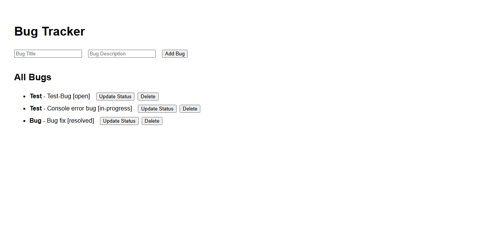
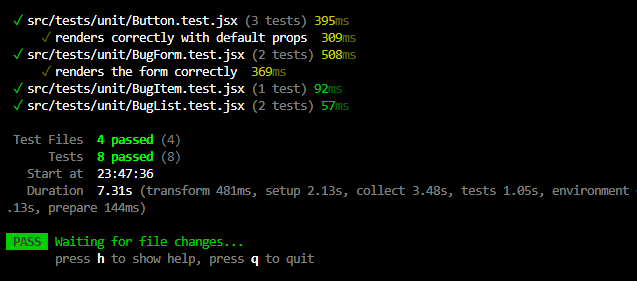
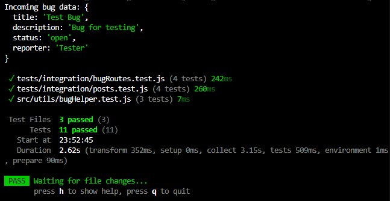

# MERN Bug Tracker App

A simple **MERN stack Bug Tracker** application that allows users to create, view, update, and delete bugs. This project demonstrates a full-stack implementation with **React, Node.js, Express, and MongoDB**, along with testing using **Vitest**.

---

##  App Overview

This is the main interface of the Bug Tracker App. Users can add new bugs, see the list of existing bugs, update their status, and delete bugs.



---

##  Client-Side Tests

The frontend components were tested using **Vitest** to ensure proper rendering and functionality. All unit tests passed successfully.



**Components tested:**
- `Button` component
- `BugForm` component
- `BugItem` component
- `BugList` component

---

##  Server-Side Tests

The backend API routes were tested to ensure proper CRUD functionality and database integration. All tests passed successfully.



**Routes tested:**
- `POST /api/bugs` – create a new bug
- `GET /api/bugs` – fetch all bugs
- `PUT /api/bugs/:id` – update a bug
- `DELETE /api/bugs/:id` – delete a bug

---

##  Features

- **Add a Bug:** Users can submit new bugs with **title, description, and status**.  
- **View Bugs:** Display all bugs in a list format.  
- **Update Bug Status:** Change the status of a bug (e.g., Open, In progress, Resolved).  
- **Delete Bugs:** Remove bugs from the list.  
- **Responsive Design:** Works on mobile and desktop.  
- **Client & Server Tests:** Ensures reliability and correctness.

---

##  Technologies Used

- **Frontend:** React, HTML, CSS  
- **Backend:** Node.js, Express.js  
- **Database:** MongoDB  
- **Testing:** Vitest  
- **Package Manager:** pnpm  

---

##  How to Run the Project

### 1. Clone the repository

git clone <https://github.com/PLP-MERN-Stack-Development/testing-and-debugging-ensuring-mern-app-reliability-Toibat22.git>
cd mern-bug-tracker

2. Install dependencies
```bash```
pnpm install

3. Start the server
```bash```
pnpm run server

4. Start the client
```bash```
pnpm run client


 ##  Project Structure

mern-bug-tracker/
│
├─ client/                      # React frontend
├─ server/                      # Express backend
│  ├─ tests/                    # Server-side tests
├─ src/                         # Backend source code
│  ├─ models/                   # Mongoose models
│  ├─ routes/                   # API routes
│  ├─ utils/                    # Helper functions / utilities
│  └─ app.js                    # Main Express app
├─ screenshots/                 # Screenshots used in README
│  ├─ bug-tracker-app.jpeg
│  ├─ vitest-client-tests-passed.png
│  └─ vitest-server-tests-passed.png
├─ vitest.config.js             # Vitest configuration for tests
├─ README.md                    # Project documentation
└─ package.json

## Author
Abdulhammed Toibat Taye

Made with Love..... PLP
